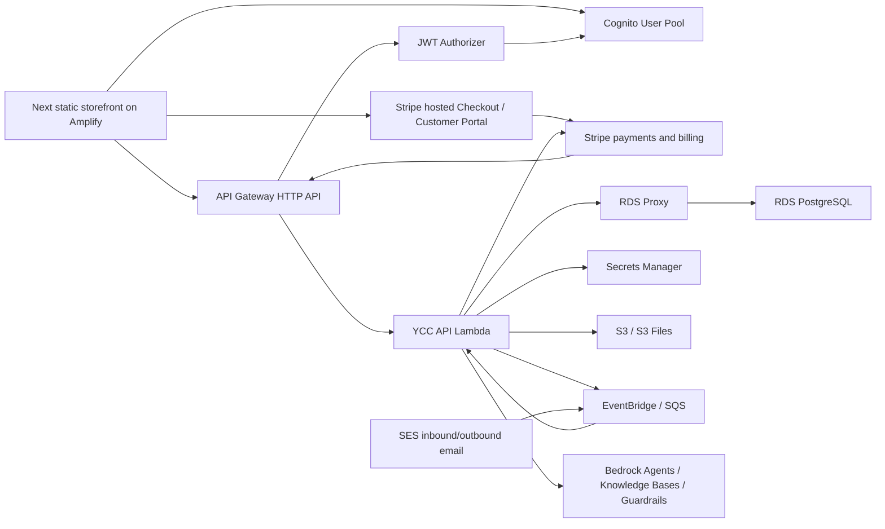

# YCC Live AWS Architecture Setup

Date: 2026-05-08
Account: 374587466106
Region: us-east-1

## Current Live State

The AWS account is now accessed by Codex through `CodexMcpYccOperatorRole`, not through root.

Working pieces:

- Root CLI access was retired on 2026-06-18 after the account security remediation pass. IAM account summary now reports `AccountAccessKeysPresent=0` and `AccountMFAEnabled=1`; root profiles such as `phantom-root` and `yuzu-amplify` no longer work from the CLI.
- Account guardrails now include account-level S3 Block Public Access, multi-region CloudTrail `ycc-security-trail`, AWS Config recorder `default`, GuardDuty detector `9bf00e4ceaa941cc8f499eaa0a6d8e40`, Security Hub with FSBP and CIS v1.2 standards `READY`, Inspector v2 for EC2/ECR/Lambda/Lambda code, IAM Access Analyzer `ycc-account-external-access`, security/operations/billing alternate contacts, and monthly budget `YCC Monthly AWS Cost Guardrail`.
- Amplify app `app7216_yuzucigarclub` serves the static storefront from branch `staging`.
- Amplify app `d2yxcklt245wh0` last received all-updates static deploy job `166` on 2026-07-03, using POSIX-path zip `yuzu-cigar-club-amplify-deploy-deploy-all-updates-20260703-2026-07-03-111256.zip`; the helper verified the live page and a referenced `_next/static` asset return HTTP `200`.
- Amplify app `d2yxcklt245wh0` is associated with AWS WAF web ACL `ycc-amplify-edge` using managed common, known-bad-inputs, Amazon IP reputation, and per-IP rate-limit rules. The older Amplify `get-app` field may still read `wafWebAclArn=null`, but WAFv2 `get-web-acl-for-resource` confirms the association to the Amplify app ARN.
- Route 53 public hosted zone `Z03644703S5ZEDRBYROZW` now hosts `yuzucigarclub.com`, with apex `A`/`AAAA` aliases to the Amplify CloudFront distribution `d1vtsjfasvs6ix.cloudfront.net` and `www` preserved as a CloudFront CNAME.
- Cognito User Pool `YCCMembers` exists for member authentication and has optional SMS MFA configured.
- Cognito app client `ycc-storefront` uses OAuth authorization code flow with no client secret.
- Cognito signup verification email uses `COGNITO_DEFAULT`, `support@yuzucigarclub.com` as the verified source identity/reply-to, subject `Yuzu Cigar Club verification code`, and a branded HTML `CONFIRM_WITH_CODE` body linking to `https://yuzucigarclub.com/friends-family/?confirmation_code={####}`. A 2026-06-18 disposable signup E2E captured the raw email in `s3://classroom2/ycc/root-email/raw/`, verified the delivered six-digit link, deleted the temp user, and verified the production page prefilled the code and cleaned the URL.
- Cognito groups exist for `admin`, `member`, `kisha`, `sensei`, `daimyo`, and `concierge_operator`.
- API Gateway HTTP API `ycc-api` is live with a `$default` auto-deploy stage and the default `execute-api` endpoint disabled. Use `https://api.yuzucigarclub.com`; the raw `https://13710cp67l.execute-api.us-east-1.amazonaws.com` endpoint should not be used by production clients.
- API Gateway `$default` access logs write JSON request records to CloudWatch log group `/aws/apigateway/ycc-api-access` with 30-day retention; a live `GET /health?deep=1` request was observed in the log stream on 2026-05-12.
- API Gateway JWT authorizer `ycc-cognito-jwt` validates tokens from the `YCCMembers` user pool.
- API Gateway routes are wired to Lambda `ycyyy`:
  - public `GET /health`
  - public `POST /newsletter/subscribe`
  - public `GET /content/pages`
  - protected `POST /concierge/chat`
  - protected `POST /support/email-draft`
  - protected `POST /content/pages`
  - protected `GET /humidor/items`
  - protected `POST /humidor/items`
  - protected `GET /account/me`
  - protected `PATCH /account/me`
- Lambda `ycyyy` now runs the YCC API handler from `infra/lambda/ycc-api/index.js`; the live alias is pinned to version `54` for the 2026-07-03 all-updates checkpoint. This includes version `53` Quon GoDaddy/Microsoft 365 SMTP sender activation, version `52` staged SMTP config, version `51` Bedrock agent least-privilege action tools, version `50` admin test member cleanup, version `49` Cognito signup member/Stripe persistence and admin roster Stripe ID deployment, version `48` signup persistence, and version `47` safer owner/admin SMS alert copy.
- Lambda `ycyyy` has runtime environment configured for Cognito, RDS Proxy, the RDS credential secret ARN, S3 bucket `classroom2`, EventBridge bus `ycc-events`, Bedrock Knowledge Base `48GFMCLSTG`, the six Bedrock Agent Runtime aliases, Amazon Lex router bot `SUYZYOVXAB` alias `AYKLRS7KYY`, Phase 5 SES inbound/support-email settings, and the GoDaddy/Microsoft 365 provider-neutral outbound email settings.
- Lambda role `ycyyy-1778040454500` has inline policy `YccApiPhase2RuntimePolicy` for the RDS secret, email-provider secret `ycc/email/godaddy-m365-smtp/prod`, CloudWatch log writes, approved S3 prefixes, `ycc-events`, selected Bedrock model/agent invocation, tagged Lex router aliases, and guarded SES compatibility from verified YCC sender identities.
- Lambda `ycyyy` has a 60 second timeout and 512 MB memory allocation.
- EventBridge bus `ycc-events` exists and is tagged for YCC.
- RDS PostgreSQL instance `database-1ycc` is available, private, encrypted, and attached to RDS Proxy.
- RDS Proxy `proxy-1778040454500-database-1ycc` is available and its target health is `AVAILABLE`.
- PostgreSQL database `postgresycc` has the Phase 3 app schema applied, including `newsletter_subscribers` and `site_page_content`.
- Protected API routes persist authenticated member, concierge, support draft, live page content, and humidor writes into the Phase 3 tables when `FEATURE_DB_WRITES=schema_ready`; the public newsletter route stores opt-ins and monthly membership interest.
- Repo-local Phase 3-12 commerce work now adds `0002_commerce_schema.sql`, `0005_member_stripe_customer_link.sql`, Lambda commerce routes, Stripe helper modules, compliance validation, frontend Stripe Checkout clients, DB member-to-Stripe Customer linking, live Stripe secret/catalog wiring, active Stripe Tax registration/defaults, and USPS Adult Signature readiness. As of Lambda version `49`, Cognito `PostConfirmation` also upserts confirmed signups into `public.members`, creates/links Stripe Customers for regular signups, and grants/links Friends & Family Box Access Pass signups using the confirmation metadata.
- Phase 4.5 Bedrock Agent Runtime is enabled for `POST /concierge/chat` through Lambda with YCC persona routing, Knowledge Base retrieval, Lambda action groups, guardrail version `8` for direct Runtime and all prepared agents, and fallback behavior if agent invocation is unavailable.
- Amazon Lex V2 bot `YCCConciergeRouter` (`SUYZYOVXAB`) is live through alias `prod` (`AYKLRS7KYY`) with `en_US` enabled, and acts as the first concierge conversation router and slot collector before Bedrock Agent Runtime.
- Bedrock Guardrail `YCCConciergeGuardrail` is versioned and associated with the Lambda runtime path and Bedrock Agents.
- Bedrock Agents exist and have prepared `prod` aliases for `YCCConcierge`, `YCCCigarGuide`, `YCCSupportAgent`, `YCCHumidorAgent`, `YCCAdminAgent`, and `YCCNewsAgent`; all six use guardrail version `8`, invoke the Lambda `live` alias executor, and route to version `8`.
- SES domain identity `yuzucigarclub.com` is verified in `us-east-1` with Easy DKIM DNS records imported into Route 53.
- Root-domain inbound mail for `yuzucigarclub.com` now routes to AWS SES `inbound-smtp.us-east-1.amazonaws.com` and stores raw messages in `s3://classroom2/ycc/root-email/raw/`.
- SES inbound support-email subdomain `ses-support.yuzucigarclub.com` also has MX pointed to `inbound-smtp.us-east-1.amazonaws.com`.
- SES receipt rule set `ycc-support-email` is active and stores raw inbound mail for `support@ses-support.yuzucigarclub.com` in `s3://classroom2/ycc/support-email/raw/`, then invokes Lambda `ycyyy`; the receipt handler routes every inbound email through `YCCSupportAgent` and stores an operator-review draft with the inbound case.
- SES send feedback is wired through configuration set `ycc-support-email-events` to SNS topic `ycc-ses-email-events` and durable SQS queue `ycc-ses-email-events` for bounce, complaint, reject, and delivery-delay events.
- Secrets Manager interface VPC endpoint `vpce-052476667bf62d2a3` exists with private DNS enabled so VPC Lambda functions can read secrets without NAT.
- Bedrock Runtime interface VPC endpoint `vpce-08ceae2011933db0e` exists with private DNS enabled so VPC Lambda functions can call Bedrock Runtime without NAT.
- Bedrock Agent Runtime interface VPC endpoint `vpce-0eaf893d65f8ec9f5` exists with private DNS enabled so VPC Lambda functions can invoke Bedrock Agents without NAT.
- S3 gateway VPC endpoint `vpce-01c1d204d461fef24` exists on route tables `rtb-05b73feb08ff385ab`, `rtb-08b3fa8234dc0123b`, and `rtb-02d54b3fe674911f0` so VPC Lambda functions can read/write approved `classroom2` prefixes.
- Dedicated private Lambda egress subnets `subnet-06116a5414f29c8bb` (`us-east-1a`, `172.31.96.0/24`) and `subnet-067af6ad21ff85cc2` (`us-east-1b`, `172.31.97.0/24`) route through NAT gateways `nat-0460beed74a121308` and `nat-06330ee4dd558e916`.
- Lambda `ycyyy` now runs in the two dedicated private subnets with security group `sg-00c3d67ac62d92ae7`; deep health confirms RDS Proxy, schema writes, Bedrock runtime, and GoDaddy/Microsoft 365 SMTP outbound readiness.
- Lambda function `ycyyy` exists in the same VPC and can be wired as the first backend handler.
- Cognito Identity Pool `YCC` exists and has unauthenticated identities disabled.
- S3 bucket `classroom2` exists and is connected to the S3 Files file system/access point.
- The Lambda, proxy, and database security groups form a narrow port-5432 path:
  - Lambda SG `lambda-rdsproxy-1` -> RDS Proxy SG `rdsproxy-lambda-1`
  - RDS Proxy SG `rdsproxy-lambda-1` -> RDS DB SG `rds-rdsproxy-1`
- The Lambda and AWS interface endpoint security groups form narrow port-443 paths:
  - Lambda SG `lambda-rdsproxy-1` -> VPC endpoint SG `ycc-secretsmanager-vpce`
  - VPC endpoint SG `ycc-secretsmanager-vpce` allows inbound 443 from the Lambda SG.
  - Lambda SG `lambda-rdsproxy-1` -> VPC endpoint SG `ycc-bedrock-runtime-vpce`
  - Lambda SG `lambda-rdsproxy-1` -> VPC endpoint SG `ycc-bedrock-agent-runtime-vpce`
  - Lambda SG `lambda-rdsproxy-1` -> S3 managed prefix list `pl-63a5400a` over port 443.
  - Lambda SG `sg-00c3d67ac62d92ae7` -> Internet via NAT on TCP/587 for GoDaddy/Microsoft 365 SMTP STARTTLS.

Gaps:

- Operator role permission gaps were fixed with `YccPhase2OperatorPermissionGapPolicy`, `YccPhase3NetworkPermissionGapPolicy`, `YccCognitoSmsOperatorPermissionGapPolicy`, `YccPhase5SesOperatorPermissionGapPolicy`, scoped `YccRoute53OperatorPermissionPolicy` access to hosted zone `Z03644703S5ZEDRBYROZW`, and `YccLambdaAliasPromotionPolicy` for `lambda:GetAlias`, `lambda:ListAliases`, and `lambda:UpdateAlias` on `ycyyy`. Do not use root credentials for routine deployments.
- RDS Proxy now requires TLS and Lambda verifies the RDS Proxy certificate with the bundled AWS RDS CA file.
- RDS deletion protection is enabled and backup retention is set to 7 days.
- The default RDS security group was removed; the narrow Lambda-to-proxy-to-DB security group path remains attached.
- Cognito app client IaC includes `ALLOW_USER_PASSWORD_AUTH`, and the live `ycc-storefront` app client was verified on 2026-05-13 with `ALLOW_USER_PASSWORD_AUTH`, `ALLOW_USER_SRP_AUTH`, and `ALLOW_REFRESH_TOKEN_AUTH` while preserving OAuth code flow settings.
- The database and Lambda remain in the default VPC, but Lambda has moved out of default public subnets into dedicated private egress subnets with NAT and endpoint routes. Lambda security group `sg-00c3d67ac62d92ae7` now allows TCP/443 egress through NAT for Stripe API calls and TCP/587 egress for STARTTLS SMTP to the GoDaddy/Microsoft 365 mailbox provider. A named production VPC remains a future improvement rather than a launch blocker.
- SES production access is final-denied under AWS case `177809591700724`, so live outbound customer support, newsletter follow-up, member welcome, and order-confirmation sends must remain off SES. AWS Support's final response says the request cannot be granted, no specific denial details can be provided, and no further responses will be sent on the subject. Do not plan on another SES appeal for this account. As of Lambda version `53`, `quon@yuzucigarclub.com` is configured through Secrets Manager secret `ycc/email/godaddy-m365-smtp/prod` as the GoDaddy/Microsoft 365 SMTP username/from/contact recipient with `EMAIL_PROVIDER=godaddy_m365_smtp`, `FEATURE_EMAIL_PROVIDER=ready`, and live health `emailProvider=godaddy_m365_smtp_ready`. Use this mailbox path only for low-volume transactional/support/welcome/order app mail, not bulk campaigns. Do not use SES per-recipient identity verification as a customer signup or onboarding step; sandbox recipient verification sends AWS-branded email and is only acceptable as a temporary operator/test exception for known inboxes.
- Twilio SendGrid is not currently a viable replacement sender for this project: ticket `27589567` closed on 2026-06-18 with account activation denied for unified account `unified_acct_UScdd6447b628befe0ef01375524876503` / `109536481`. Treat SendGrid as unavailable unless Twilio explicitly reverses that decision. Brevo, Mailgun, Postmark, and SendGrid code paths remain optional fallback integrations, but they are not required for the no-new-spend GoDaddy/Microsoft 365 SMTP path.
- The production root-domain mailbox route now terminates at SES. Root-domain mail is captured as raw S3 objects only; production support automation still uses the `support@ses-support.yuzucigarclub.com` receipt path until root-domain routing is intentionally wired into Lambda.
- Direct operator CLI retrieval against the Knowledge Base is not currently allowed by the scoped operator role. The live agents can retrieve through their Bedrock runtime role.
- Live Stripe API key, webhook signing secret, Customer Portal configuration, tobacco approval confirmation, membership Price IDs, age-verification settings, Stripe Tax registration/defaults, USPS Adult Signature readiness, and internal signing secrets are stored in Secrets Manager secret `ycc/commerce/prod` and exposed to Lambda through `COMMERCE_PROVIDER_SECRET_ARN`. The full 923-item published catalog is loaded into Stripe and the SKU-to-Price mapping is stored at `s3://classroom2/ycc/commerce/stripe-launch-catalog.json`. Stripe Support confirmed on 2026-05-25 that Company Q meets the Stripe Services Agreement; the secret records that approval. Direct live Stripe checks on 2026-05-26 show charges enabled, no currently due or past-due account requirements, the commerce webhook enabled, active products/prices present, no first-page disputes/subscriptions, no Stripe Customers to backfill, Stripe Tax active with Gilbert, AZ head office and active AZ registration `taxreg_1TbQiD0r0rWXiDV5IKP7bReS`, and Stripe payouts not enabled.

## Production Launch Hardening Ownership

These items must be closed before production commerce launch. Owners are functional owners, not named individuals; assign named operators during launch-week planning.

| Gap | Owner | Status | Launch Requirement |
| --- | --- | --- | --- |
| RDS Proxy `RequireTLS=false` | Infrastructure operator | Closed 2026-05-07 | `proxy-1778040454500-database-1ycc` now has `RequireTLS=true`; Lambda uses `RDS_SSLMODE=verify-full` with the bundled RDS CA file. |
| RDS deletion protection disabled | Infrastructure operator | Closed 2026-05-07 | `database-1ycc` deletion protection is enabled with 7-day backup retention. |
| Default RDS security group still attached | Infrastructure operator | Closed 2026-05-07 | Default DB security group was removed; the database keeps the validated Lambda-to-proxy-to-DB security group path. |
| Cognito inline password auth flow missing on live app client | Identity operator | Closed 2026-05-13 | App client `2i2nvtt41l94n0mivc4tu4f9ms` now has `ALLOW_USER_PASSWORD_AUTH` with OAuth code flow, callback URLs, logout URLs, token validity, token revocation, and user-existence error settings preserved. |
| Default public subnet Lambda egress | Infrastructure operator | Closed 2026-05-12 | Lambda `ycyyy` now runs in dedicated private egress subnets `subnet-06116a5414f29c8bb` and `subnet-067af6ad21ff85cc2` with NAT gateways `nat-0460beed74a121308` and `nat-06330ee4dd558e916`. A named production VPC remains a future hardening item. |
| SES production access | Support/email operator | Final denied 2026-06-18; mailbox SMTP active 2026-07-03 | AWS case `177809591700724` is closed with a final denial. Keep `FEATURE_SES=pending_production_access` so SES outbound sends stay disabled; low-volume app mail now uses the guarded GoDaddy/Microsoft 365 SMTP provider through `quon@yuzucigarclub.com` after credential storage, IAM, egress, and smoke-test verification. |
| WAF/rate limiting missing from public edge/API | Security operator | Closed 2026-05-12 | Amplify is associated with CloudFront-scope WAF web ACL `ycc-amplify-edge`; API Gateway detailed metrics and route throttles remain enabled. |
| CloudWatch alarms incomplete | Operations operator | Baseline closed 2026-05-07 | Baseline alarms now cover Lambda errors/throttles, API 4xx/5xx, RDS CPU/storage/connections, and RDS Proxy client connections. Add vendor-specific alarms after Stripe, age, and shipping integrations go live. |
| Backup retention/restore drill not launch-approved | Infrastructure operator | Closed 2026-05-12 | Backup retention is set to 7 days; point-in-time restore drill `ycc-restore-drill-20260512-1640` reached `available` as encrypted PostgreSQL 18.3 and was deleted after verification. |
| `YCCNewsAgent` Bedrock IDs pending | AI operations operator | Closed 2026-05-07 | Created `YCCNewsAgent` `TUVBTVKNXG`, prepared `prod` alias `G25GBEUUMG`, attached Knowledge Base `48GFMCLSTG`, attached action group `YCCOperations`, tuned guardrail/prompt, and configured Lambda env/defaults. |
| Stripe/tobacco commerce approval not attached | Commerce operator | Closed 2026-05-26 | Stripe Support email received 2026-05-25 confirmed Company Q meets the Stripe Services Agreement and no further account action is needed. `ycc/commerce/prod` now carries `stripe.tobaccoApprovalConfirmed=true`, and `npm run launch:go-live-check` passes `stripe-approval`. |
| Stripe/age/tax/shipping secrets not stored for commerce routes | Backend operator | Closed 2026-05-26 | Secret `ycc/commerce/prod` now stores the live Stripe key, webhook secret, Customer Portal configuration, 12 membership recurring Price IDs, generated internal signing secrets, age-verification settings, Stripe approval confirmation, USPS Adult Signature readiness, Stripe Tax head-office state, active AZ registration `taxreg_1TbQiD0r0rWXiDV5IKP7bReS`, default tax code `txcd_99999999`, default tax behavior `exclusive`, and an S3 pointer for the full launch catalog. Stripe has 923 active catalog Products and 923 active catalog Prices. Lambda `ycyyy` reads the secret through `COMMERCE_PROVIDER_SECRET_ARN` and the catalog from `s3://classroom2/ycc/commerce/stripe-launch-catalog.json`. |
| USPS adult-signature setup not verified | Fulfillment operator | Closed 2026-05-26 | Fulfillment confirmed USPS Adult Signature is ready. `ycc/commerce/prod` now records `shipping.provider=USPS`, `shipping.adultSignatureCarrierApproved=true`, and nested `shipping.adultSignature.ready=true`; `npm run launch:go-live-check` passes `adult-signature-carrier`. |

## Phase 1 Live Outputs

Use these values in the storefront/backend environment:

```env
NEXT_PUBLIC_YCC_API_BASE_URL=https://api.yuzucigarclub.com
NEXT_PUBLIC_COGNITO_USER_POOL_ID=us-east-1_63U9PflAX
NEXT_PUBLIC_COGNITO_USER_POOL_CLIENT_ID=2i2nvtt41l94n0mivc4tu4f9ms
NEXT_PUBLIC_COGNITO_ISSUER=https://cognito-idp.us-east-1.amazonaws.com/us-east-1_63U9PflAX
NEXT_PUBLIC_COGNITO_HOSTED_UI_BASE=https://ycc-members-374587466106.auth.us-east-1.amazoncognito.com
```

Verification:

- `GET https://api.yuzucigarclub.com/health?deep=1` returns `200` from Lambda.
- `GET https://13710cp67l.execute-api.us-east-1.amazonaws.com/health?deep=1` no longer serves the health route after disabling the default execute-api endpoint.
- Protected routes require a Cognito JWT through the `Authorization` header.
- The `$default` API stage is tagged with `Project=YCC`, `ManagedBy=CodexMCP`, and `Environment=prod`.

## Phase 2 Live Outputs

Lambda package:

- Source: `infra/lambda/ycc-api/index.js`
- README: `infra/lambda/ycc-api/README.md`
- Superseded Phase 2 package artifact: `output/ycc-api-lambda-phase2-2026-05-06.zip`
- Current live package is the Phase 3 persistence artifact listed below.

Runtime environment:

```env
APP_ENV=prod
AWS_NODEJS_CONNECTION_REUSE_ENABLED=1
COGNITO_USER_POOL_ID=us-east-1_63U9PflAX
COGNITO_USER_POOL_CLIENT_ID=2i2nvtt41l94n0mivc4tu4f9ms
DB_PROXY_ENDPOINT=proxy-1778040454500-database-1ycc.proxy-cuvgmek2eh9j.us-east-1.rds.amazonaws.com
DB_PORT=5432
DB_NAME=postgresycc
EVENT_BUS_NAME=ycc-events
S3_APP_BUCKET=classroom2
FEATURE_DB_WRITES=schema_ready
FEATURE_BEDROCK=runtime_ready
FEATURE_LEX_ROUTER=ready
LEX_ROUTER_BOT_ID=SUYZYOVXAB
LEX_ROUTER_BOT_ALIAS_ID=AYKLRS7KYY
LEX_ROUTER_LOCALE_ID=en_US
# AWS SES case 177809591700724 final-denied; keep non-ready for live app outbound mail.
FEATURE_SES=pending_production_access
SUPPORT_EMAIL_FROM=support@yuzucigarclub.com
SUPPORT_EMAIL_RAW_BUCKET=classroom2
SUPPORT_EMAIL_RAW_PREFIX=ycc/support-email/raw/
SUPPORT_EMAIL_INBOUND_RECIPIENT=support@ses-support.yuzucigarclub.com
BEDROCK_MODEL_ID=amazon.nova-lite-v1:0
BEDROCK_GUARDRAIL_ID=xczjnv3f1wzs
BEDROCK_GUARDRAIL_VERSION=8
BEDROCK_KNOWLEDGE_BASE_ID=48GFMCLSTG
BEDROCK_AGENT_YCCCONCIERGE_ID=NDIEDXNZAV
BEDROCK_AGENT_YCCCONCIERGE_ALIAS_ID=XXAQKDKDC0
BEDROCK_AGENT_YCCCIGARGUIDE_ID=EJI2VA7AVF
BEDROCK_AGENT_YCCCIGARGUIDE_ALIAS_ID=1JO8IAN4BL
BEDROCK_AGENT_YCCSUPPORTAGENT_ID=SJJ2DVNYES
BEDROCK_AGENT_YCCSUPPORTAGENT_ALIAS_ID=LIFBQL76AE
BEDROCK_AGENT_YCCHUMIDORAGENT_ID=XLN9JKVRDA
BEDROCK_AGENT_YCCHUMIDORAGENT_ALIAS_ID=SOHCW5780U
BEDROCK_AGENT_YCCADMINAGENT_ID=UQWB6AKMBT
BEDROCK_AGENT_YCCADMINAGENT_ALIAS_ID=IHCMS7T9PB
BEDROCK_AGENT_YCCNEWSAGENT_ID=TUVBTVKNXG
BEDROCK_AGENT_YCCNEWSAGENT_ALIAS_ID=G25GBEUUMG
```

Phase 2 verification:

- `GET /health` returns the YCC API service contract.
- `GET /health?deep=1` returns `db.proxyReachable=true`, confirming Lambda can reach RDS Proxy over TCP.
- `GET /account/me` without a token returns `401` through API Gateway.
- Direct Lambda invoke with Cognito-like claims returns a `YCCCigarGuide` contract for cigar-guide questions.
- `npm test` passes with 79 tests, including Lambda contract, protected-route persistence, and Phase 3 schema tests.
- Lambda role policy `YccApiPhase2RuntimePolicy` is attached.
- IAM simulation allows the required Lambda execution-role actions:
  - `secretsmanager:GetSecretValue` on the RDS credential secret
  - `logs:PutLogEvents` on `/aws/lambda/ycyyy`
  - `events:PutEvents` on `ycc-events`
  - `s3:PutObject` on `classroom2/ycc/*`
  - `bedrock:InvokeModel` on the selected Nova models
  - `lex:RecognizeText` on tagged YCC Lex bot aliases after a router bot alias is created
  - `ses:SendEmail` from `support@yuzucigarclub.com`
- IAM simulation denies `ses:SendEmail` from an unapproved sender address.
- EventBridge bus `ycc-events` exists and is tagged.

Permission bootstrap used to close the gap:

```powershell
uv tool run --from awscli aws iam put-role-policy `
  --role-name CodexMcpYccOperatorRole `
  --policy-name YccPhase2OperatorPermissionGapPolicy `
  --policy-document file://infra/ycc-phase2-operator-permission-gap-policy.json `
  --profile <admin-profile> `
  --region us-east-1
```

After that bootstrap policy was attached, this repo script completed Phase 2 permissions with the normal scoped profile:

```powershell
.\scripts\apply-ycc-phase2-permissions.ps1 -Profile ycc-mcp -Region us-east-1
```

## Phase 3 Live Outputs

Schema migration:

- SQL: `infra/database/migrations/0001_phase3_app_schema.sql`
- Migration: `0001_phase3_app_schema`
- Database: `postgresycc`
- Applied at: `2026-05-06T09:55:35.353Z`
- Tables verified: 11
- Indexes verified: 35
- Missing tables: none

Tables:

- `schema_migrations`
- `members`
- `member_profiles`
- `conversations`
- `conversation_messages`
- `support_cases`
- `support_email_messages`
- `humidor_items`
- `smoke_logs`
- `audit_log`
- `provider_connections`

Lambda package:

- Deployed package artifact: `output/ycc-api-lambda-persistence-2026-05-06.zip`
- Live Lambda code hash: `TIW8sU3cq86kWMZC1/7M3k0yKb1Ra7K+wxB54Pos6DI=`
- Direct migration invoke is guarded by `source=ycc.phase3.migration` and confirmation token `APPLY_YCC_PHASE3_SCHEMA`.

Network prerequisite added:

- Secrets Manager VPC endpoint: `vpce-052476667bf62d2a3`
- Service: `com.amazonaws.us-east-1.secretsmanager`
- Private DNS: enabled
- Endpoint SG: `sg-0c84d6f53a1ced73f`
- Setup script: `scripts/setup-ycc-secretsmanager-vpce.ps1`

Permission bootstrap used to create the endpoint:

```powershell
uv tool run --from awscli aws iam put-role-policy `
  --role-name CodexMcpYccOperatorRole `
  --policy-name YccPhase3NetworkPermissionGapPolicy `
  --policy-document file://infra/ycc-phase3-network-permission-gap-policy.json `
  --profile <admin-profile> `
  --region us-east-1
```

Verification:

- Direct Lambda invoke `verify_phase3_schema` returns `status=verified`, `tableCount=11`, `indexCount=35`, and `missingTables=[]`.
- `GET /health?deep=1` returns `databaseWrites=schema_ready` and `db.proxyReachable=true`.
- Direct Lambda invokes with Cognito-like claims store route data in `members`, `conversations`, `conversation_messages`, `support_cases`, `support_email_messages`, `humidor_items`, and `audit_log`.
- Live persistence smoke IDs from 2026-05-06:
  - account/member: `11d8bf15-48c1-4c1a-a8cb-7c77b3948abb`
  - concierge conversation: `9b6033b3-c813-4e82-b3c2-bee2ea900b6e`
  - support case: `c8a1f751-2085-4eaf-be14-b00726ce3737`
  - humidor item: `f6ac34f8-f0bd-4fe5-bc89-cf110c04d110`

## Phase 4 Live Outputs

Lambda AI runtime:

- Deployed package artifact: `output/ycc-api-lambda-phase45-agent-runtime-2026-05-06.zip`
- Live Lambda code hash: `z8gJ8V36rIT1e7yv/qtUc1gHmnJFEiQ/t4s8UJD9m1w=`
- Runtime model: `amazon.nova-lite-v1:0`
- Runtime feature flag: `FEATURE_BEDROCK=runtime_ready`
- Lex router flag: `FEATURE_LEX_ROUTER=pending_bot` until the YCC Lex V2 bot alias is created/tagged and `LEX_ROUTER_BOT_ID` / `LEX_ROUTER_BOT_ALIAS_ID` are set on Lambda.
- `POST /concierge/chat` routes to `YCCConcierge`, `YCCCigarGuide`, `YCCSupportAgent`, `YCCHumidorAgent`, `YCCAdminAgent`, or `YCCNewsAgent`. `YCCCigarGuide` uses direct Bedrock Runtime with knowledge-base context; other specialist agents invoke the selected Bedrock Agent Runtime alias when configured.
- `YCCAdminAgent` and `YCCNewsAgent` are restricted to Cognito `admin` and `concierge_operator` groups.

Guardrail:

- Name: `YCCConciergeGuardrail`
- Guardrail ID: `xczjnv3f1wzs`
- Guardrail ARN: `arn:aws:bedrock:us-east-1:374587466106:guardrail/xczjnv3f1wzs`
- Current guardrail version: `8`
- Config: `infra/ycc-phase4-guardrail.json`
- Prepared Bedrock agent aliases use guardrail version `8`. Lambda direct Runtime calls attach this guardrail when the serving Lambda version has `BEDROCK_ENABLE_GUARDRAILS=1`; the `live` alias points to Lambda version `4`, which has that setting.
- Earlier versions `1` through `7` were superseded while tuning the guardrail so adult cigar education/editorial language is allowed, explicit minor or age-check bypass requests remain blocked, and off-domain sexual content remains blocked.

Bedrock Runtime VPC endpoint:

- Endpoint: `vpce-08ceae2011933db0e`
- Service: `com.amazonaws.us-east-1.bedrock-runtime`
- Private DNS: enabled
- Endpoint SG: `sg-08a5274b522caba3e`
- Setup script: `scripts/setup-ycc-bedrock-runtime-vpce.ps1`
- Endpoint policy: `infra/ycc-phase45-bedrock-runtime-vpce-policy.json`, scoped to the Lambda execution role, Nova Micro/Lite foundation models, and guardrail `xczjnv3f1wzs`.
- Policy reapply script: `scripts/apply-ycc-bedrock-vpce-policies.ps1`

Bedrock Agent Runtime VPC endpoint:

- Endpoint: `vpce-0eaf893d65f8ec9f5`
- Service: `com.amazonaws.us-east-1.bedrock-agent-runtime`
- Private DNS: enabled
- Endpoint SG: `sg-0397e8dec94b262a5`
- Endpoint policy: `infra/ycc-phase45-bedrock-agent-runtime-vpce-policy.json`, allowing the six prepared YCC `prod` aliases including `YCCNewsAgent` `TUVBTVKNXG/G25GBEUUMG`.
- Policy reapply script: `scripts/apply-ycc-bedrock-vpce-policies.ps1`

Bedrock agent service role:

- Role: `arn:aws:iam::374587466106:role/YccBedrockAgentRuntimeRole`
- Trust policy: `infra/ycc-phase4-bedrock-agent-trust-policy.json`
- Runtime policy: `infra/ycc-phase4-bedrock-agent-runtime-policy.json`
- Root-approved bootstrap created this role and attached its inline runtime policy.
- Operator role inline policy `YccPhase4PrepareAgentPermissionGapPolicy` grants `bedrock:PrepareAgent` for all six YCC agent ARNs, including `YCCNewsAgent`; it was re-applied live on 2026-05-27 after the News prepare gap was found.

Prepared agent aliases:

| Agent | Agent ID | Alias | Alias ID | Version |
| --- | --- | --- | --- | --- |
| `YCCConcierge` | `NDIEDXNZAV` | `prod` | `XXAQKDKDC0` | `8` |
| `YCCCigarGuide` | `EJI2VA7AVF` | `prod` | `1JO8IAN4BL` | `8` |
| `YCCSupportAgent` | `SJJ2DVNYES` | `prod` | `LIFBQL76AE` | `8` |
| `YCCHumidorAgent` | `XLN9JKVRDA` | `prod` | `SOHCW5780U` | `8` |
| `YCCAdminAgent` | `UQWB6AKMBT` | `prod` | `IHCMS7T9PB` | `8` |
| `YCCNewsAgent` | `TUVBTVKNXG` | `prod` | `G25GBEUUMG` | `8` |

## Phase 4.5 Live Outputs

Bedrock Knowledge Base:

- Knowledge Base: `YCCKnowledgeBaseV2`
- Knowledge Base ID: `48GFMCLSTG`
- Data source ID: `7YMKRXKLPX`
- Source prefix: `s3://classroom2/ycc/knowledge-base/`
- S3 Vector bucket: `ycc-kb-vectors-374587466106-us-east-1`
- S3 Vector index: `ycc-kb-index-v2`
- Ingestion job `ODXEKTRRPY` completed with 5 scanned, 5 indexed, 0 failed.
- Superseded first attempt: Knowledge Base `3PFQBYXF0A`, ingestion job `RS9508FJWF`, failed because Bedrock metadata fields were filterable. The corrected index marks `AMAZON_BEDROCK_TEXT` and `AMAZON_BEDROCK_METADATA` non-filterable.

Bedrock action group:

- Action group name: `YCCOperations`
- Lambda executor: `arn:aws:lambda:us-east-1:374587466106:function:ycyyy:live`
- Function schema catalog: `infra/bedrock/ycc-agent-action-group-functions.json`
- Per-agent action-group contract: `infra/bedrock/ycc-agent-action-group-config.json`
- Confirmed admin fixes: `YCCAdminAgent` exposes `UpdateAdminOrder` for order status, fulfillment, and compliance updates and `UpdateAdminMemberAccess` for role, member status, and membership tier updates. Both require Bedrock confirmation and write durable audit rows. `UpdateAdminOrder` allows `admin` and `concierge_operator` sessions; `UpdateAdminMemberAccess` is admin-only.
- Live least-privilege tool matrix:
  - `YCCConcierge`: `GetMemberProfile`, `DraftSupportReply`
  - `YCCCigarGuide`: `GetMemberProfile`
  - `YCCSupportAgent`: `GetMemberProfile`, `DraftSupportReply`
  - `YCCHumidorAgent`: `GetMemberProfile`, `AddHumidorItem`
  - `YCCAdminAgent`: `GetMemberProfile`, `DraftSupportReply`, `GetAdminQueueSummary`, `UpdateAdminOrder`, `UpdateAdminMemberAccess`
  - `YCCNewsAgent`: `DraftWeeklyNews`
- Action group IDs:
  - `YCCConcierge`: `OJ55YKPRPN`
  - `YCCCigarGuide`: `CMG2BD9LV2`
  - `YCCSupportAgent`: `XCNEG2HH2D`
  - `YCCHumidorAgent`: `5OHFAPSKIZ`
  - `YCCAdminAgent`: `LXAO8KDDKZ`
  - `YCCNewsAgent`: `ZKQEGPSMFR`

Phase 4 verification:

- All six agents are `PREPARED`.
- All six `prod` aliases are `PREPARED` and accept invocations.
- Direct Lambda invoke of `POST /concierge/chat` with Cognito-like claims returns `ai.status=bedrock_runtime` for `YCCCigarGuide`, uses Knowledge Base `48GFMCLSTG`, and serves through a Lambda version with direct Runtime guardrails enabled.
- Direct Lambda invoke of `POST /concierge/chat` with admin/concierge Cognito-like claims and `agent=weekly_news` returns `ai.status=bedrock_agent_runtime` and a draft with source-note placeholders for `YCCNewsAgent` `TUVBTVKNXG/G25GBEUUMG`.
- Direct Lambda action-group invoke for `DraftSupportReply` stores a support case and draft email.
- Direct Lambda action-group invoke for `GetAdminQueueSummary` returns `REPROMPT` and `admin_agent_forbidden` for a non-admin session.
- Direct Lambda action-group invoke for `UpdateAdminOrder` updates a persisted order and writes `commerce_audit_log`; `UpdateAdminMemberAccess` rejects concierge-only sessions and requires an `admin` group before updating a member and writing `audit_log`.
- Direct Lambda action-group invoke for `UpdateAdminOrder` through the wrong agent surface returns `REPROMPT` and `wrong_agent_tool`, so a stale/misconfigured action group cannot enter an admin write path.
- Direct Lambda action-group invoke for `DraftWeeklyNews` requires an admin/concierge operator and returns a review-ready draft package.
- `npm run ai-agents:ops-check -- --live --json` passes and confirms all six aliases route to version `8`, all six action groups match the least-privilege function contracts, all six routed versions have Knowledge Base `48GFMCLSTG` enabled, Lambda `ycyyy:live` is version `54`, and API deep health/auth boundary checks pass.
- `npm test` passes with Bedrock Agent Runtime alias routing for specialist agents, direct Bedrock Runtime for the cigar guide, action-group persistence, admin/news-agent access control, wrong-agent tool refusal, and conversation agent constraint checks.

## Target Architecture

The static storefront remains on Amplify. Dynamic app behavior should move behind a serverless backend. Stripe is the chosen production payment and billing platform, while Yuzu keeps the backend system of record for regulated commerce decisions, orders, memberships, support, and audit logs.



## Commerce Architecture Decision

Stripe owns payment processing, hosted Checkout, Billing/subscriptions, Products, Prices, invoices, receipts, refunds, disputes, Customer Portal, and customer payment records.

Yuzu owns catalog publishing state, inventory and allocation decisions, cart validation, age verification, destination legality, shipping eligibility, adult-signature requirements, tobacco tax/excise workflow, order records, fulfillment status, membership entitlements, support records, compliance holds, and audit logs.

The static storefront must call the API Gateway/Lambda backend for Checkout Session creation, Customer Portal sessions, order status, member subscription status, and admin commerce actions. Stripe webhooks must terminate at the backend, verify `STRIPE_WEBHOOK_SECRET`, and process events idempotently before orders or entitlements are considered fulfilled.

Planned commerce routes:

- `POST /commerce/checkout-session`
- `POST /commerce/membership-session`
- `POST /commerce/customer-portal-session`
- `POST /commerce/webhook/stripe`
- `GET /commerce/checkout-session/{id}`
- `GET /commerce/orders/{id}`
- `GET /commerce/membership`
- `POST /admin/commerce/stripe-sync-products`
- `GET /admin/commerce/webhook-events`
- `GET /admin/commerce/compliance-holds`

Repo implementation status:

- `infra/database/migrations/0002_commerce_schema.sql` defines Stripe events, commerce orders, order items, member subscriptions, compliance holds, and commerce audit log tables.
- `infra/database/migrations/0005_member_stripe_customer_link.sql` adds `members.stripe_customer_id`, backfills it from subscription/order Stripe Customer IDs, and protects it with a partial unique index.
- `infra/lambda/ycc-api/commerce-rules.js` contains the server-side launch compliance validator.
- `infra/lambda/ycc-api/stripe-commerce.js` contains Stripe Checkout, Billing, Customer Portal, webhook verification, and event-action helpers.
- `infra/lambda/ycc-api/index.js` now registers the commerce route contract, reads live commerce settings from Secrets Manager, and intentionally rejects product checkout when compliance providers such as Stripe Tax or adult-signature shipping are not ready. Current live secret state marks Stripe Tax and USPS Adult Signature ready.
- Static frontend checkout calls `NEXT_PUBLIC_YCC_API_BASE_URL` and redirects only to backend-created Stripe Checkout URLs.

## Setup Phases

### Phase 1: Identity And API Edge

Create:

- Cognito User Pool `YCCMembers`
- IAM role `YccCognitoSmsRole` for Cognito SMS MFA delivery through Amazon SNS
- App client `ycc-storefront`
- Groups: `admin`, `member`, `kisha`, `sensei`, `daimyo`, `concierge_operator`
- API Gateway HTTP API `ycc-api`
- JWT authorizer using the Cognito User Pool issuer and app client audience
- Routes:
  - `GET /health`
  - `POST /concierge/chat`
  - `POST /support/email-draft`
  - `POST /humidor/items`
  - `GET /account/me`
  - `PATCH /account/me`

Public route:

- `GET /health`

Protected routes:

- Everything else should require Cognito JWT auth.

### Phase 2: Lambda Backend Contract

Promote `ycyyy` or replace it with `ycc-api` Lambda.

Required runtime config:

- `DB_PROXY_ENDPOINT`
- `DB_SECRET_ARN`
- `DB_NAME`
- `AWS_NODEJS_CONNECTION_REUSE_ENABLED=1`
- `APP_ENV=prod`

Required IAM additions for the Lambda execution role:

- Read only the RDS credential secret.
- Write CloudWatch Logs.
- Invoke selected Bedrock models/agents.
- Read/write only approved S3 prefixes.
- Send events to the YCC EventBridge bus.
- Send SES email only from verified YCC identities.

Current Phase 2 status:

- API handler deployed.
- Environment configured.
- RDS Proxy deep health check passes.
- IAM runtime policy is applied.
- EventBridge bus `ycc-events` is created and tagged.
- SES permissions are applied for verified YCC sender identities. The domain identity `yuzucigarclub.com` is verified, but production SES customer sending remains final-denied and guarded; low-volume app email uses the selected current-tools provider only after SMTP credential setup and smoke tests.

### Phase 3: Database Schema

Create PostgreSQL tables for:

- `members`
- `member_profiles`
- `conversations`
- `conversation_messages`
- `support_cases`
- `support_email_messages`
- `humidor_items`
- `smoke_logs`
- `audit_log`
- `provider_connections`

Every write path should include `actor_id`, `request_id`, and `created_at`.

Current Phase 3 status:

- Migration `0001_phase3_app_schema` is applied to `postgresycc`.
- All required tables are present.
- Required foreign-key and filtered access-path indexes are present.
- Every write table includes `actor_id`, `request_id`, and `created_at`.
- Lambda health reports `FEATURE_DB_WRITES=schema_ready`.
- Protected API routes now persist member, conversation, support draft, and humidor writes into these tables.

### Phase 4: AI Concierge

Create:

- Bedrock Knowledge Base from catalog, education, membership, support, and compliance docs.
- Bedrock Guardrail for tobacco-age gating, PII filtering, compliance boundaries, and no health claims.
- Bedrock Agent `YCCConcierge`.
- Optional specialist agents:
  - `YCCCigarGuide`
  - `YCCSupportAgent`
  - `YCCHumidorAgent`
- Internal specialist agent:
  - `YCCAdminAgent`
  - `YCCNewsAgent`

The agent should call Lambda action groups instead of touching the database directly.

Current Phase 4 status:

- Bedrock Guardrail is created and versioned.
- Bedrock Runtime private endpoint is available.
- Bedrock Agent Runtime private endpoint is available.
- Lambda `POST /concierge/chat` invokes the selected Bedrock Agent Runtime alias first, then falls back to direct Bedrock Runtime if needed.
- Six Bedrock Agents and `prod` aliases are prepared, including `YCCNewsAgent` version `8` for the weekly education/newsletter workflow.
- Knowledge Base and Lambda action groups are attached to all six prepared agents.

### Phase 5: Email Support

Create:

- SES verified domain or email identity.
- SES receipt rule for support email.
- S3 prefix for raw inbound email.
- EventBridge/SQS processing path.
- Lambda processor that creates `support_cases` and drafts agent replies.

Current Phase 5 status:

- SES domain identity `yuzucigarclub.com` is verified in `us-east-1`.
- Route 53 hosted zone `Z03644703S5ZEDRBYROZW` hosts the SES Easy DKIM CNAME records for `yuzucigarclub.com`.
- SES production-access request was submitted on 2026-05-06 and later denied under case `177809591700724`; `ProductionAccessEnabled=false` was rechecked on 2026-05-20.
- AWS Support sent a final denial for case `177809591700724` on 2026-06-18 and stated there will be no additional responses on the subject. API resubmission on 2026-05-20 returned `ConflictException`, and the account should now be treated as unable to use SES for production outbound mail.
- Lambda now has a branded member welcome email flow that runs only after membership activation: Friends & Family Box Pass entitlement grant or an active Stripe subscription webhook. The Lambda code also supports provider-neutral support/contact, newsletter follow-up, member welcome, and Stripe order-confirmation sends through `EMAIL_PROVIDER` plus `FEATURE_EMAIL_PROVIDER=ready`, including the no-new-spend `godaddy_m365_smtp` provider. The first signup email remains the branded Cognito verification email; SES sandbox recipient verification must not be triggered automatically for customers because it produces a separate AWS verification message.
- Lambda version `53` enables the GoDaddy/Microsoft 365 SMTP path with `EMAIL_PROVIDER=godaddy_m365_smtp`, `FEATURE_EMAIL_PROVIDER=ready`, `EMAIL_PROVIDER_SECRET_ARN` pointing at Secrets Manager secret `ycc/email/godaddy-m365-smtp/prod`, `M365_SMTP_USERNAME=quon@yuzucigarclub.com`, `SUPPORT_EMAIL_FROM=quon@yuzucigarclub.com`, `SUPPORT_CONTACT_EMAIL_TO=quon@yuzucigarclub.com`, host `smtp.office365.com`, and port `587`. The Lambda role can read the secret, and security group `sg-00c3d67ac62d92ae7` allows TCP/587 egress for STARTTLS SMTP.
- Deployed Lambda package artifact `C:\Users\qfash\Documents\Yuzu Deploy Artifacts\ycc-api-current-tools-m365-smtp-20260702.zip` to `ycyyy:live` version `46` with code hash `/MrlmX7H+o5TiToLVYHK2bK1Hlz9Z/XLLAFAJkn9ToM=`. This version adds the GoDaddy/Microsoft 365 SMTP current-tools path and keeps live sending guarded by the existing `FEATURE_SES=pending_production_access` environment while no GoDaddy/Microsoft 365 SMTP credential is configured.
- Deployed Lambda package artifact `output/ycc-api-member-welcome-email-20260618.zip` to `ycyyy:live` version `41` with code hash `EMYU78bngAbT/8yowT+hslmMk+IlVtyl0fDr8aLQsig=`. This version was superseded by the owner/admin SMS wording deployment below.
- Public trust pages `https://www.yuzucigarclub.com/privacy/` and `https://www.yuzucigarclub.com/terms/` return HTTP `200`, are included in the production sitemap, and now include mobile opt-in privacy language plus SMS terms for message frequency, message/data rates, STOP/HELP, customer care, carrier liability, and privacy-policy linkage.
- Root MX for `yuzucigarclub.com` points to `10 inbound-smtp.us-east-1.amazonaws.com.` with TTL `300`.
- SES root-domain receipt rule `ycc-root-domain-email-inbound` stores all `yuzucigarclub.com` inbound mail in `s3://classroom2/ycc/root-email/raw/`.
- SES inbound subdomain `ses-support.yuzucigarclub.com` is configured with:
  - DKIM CNAME records for the SES identity `ses-support.yuzucigarclub.com`
  - MX record `ses-support.yuzucigarclub.com -> inbound-smtp.us-east-1.amazonaws.com`
- Active SES receipt rule set: `ycc-support-email`.
- Receipt rules:
  - `ycc-root-domain-email-inbound` for `yuzucigarclub.com`, raw prefix `s3://classroom2/ycc/root-email/raw/`
  - `ycc-support-email-inbound` for `support@ses-support.yuzucigarclub.com`, raw prefix `s3://classroom2/ycc/support-email/raw/`, then Lambda `ycyyy:live`
- SES feedback configuration set: `ycc-support-email-events`.
- SES feedback SNS topic: `arn:aws:sns:us-east-1:374587466106:ycc-ses-email-events`.
- SES feedback SQS queue: `https://sqs.us-east-1.amazonaws.com/374587466106/ycc-ses-email-events`.
- Feedback events captured: `BOUNCE`, `COMPLAINT`, `REJECT`, and `DELIVERY_DELAY`.
- Lambda invoke permission statement: `YccSesSupportEmailInvoke`.
- API Gateway route `POST /support/email-send` is registered behind the Cognito JWT authorizer.
- Lambda package artifact: `output/ycc-api-lambda-phase5-ses-support-2026-05-06-r3.zip`.
- Lambda code hash: `DX91MpoThl7cgrAEObllYyuBhw7nOmR4MP2xnUl+EGA=`.
- Lambda supports:
  - `POST /support/email-send` for admin/concierge-operator outbound sends once the selected provider is configured and ready
  - SES receipt events that read the raw S3 message, route the email through `YCCSupportAgent`, and persist inbound `support_cases`, received `support_email_messages`, and operator-review outbound draft messages

Remaining Phase 5 gates:

- Keep the GoDaddy/Microsoft 365 SMTP path limited to low-volume transactional/support/welcome/order app mail. Run a Stripe order-confirmation smoke on the next order-flow verification pass before relying on it for paid-order customer mail. If signup email also needs full provider control later, use Cognito's custom email sender trigger with the selected provider rather than SES recipient verification.
- Decide whether root-domain support mail should remain raw-only, forward internally to `support@ses-support.yuzucigarclub.com`, or get its own Lambda receipt action.

Phase 5 verification:

- DNS resolves SES DKIM CNAMEs for `yuzucigarclub.com`.
- DNS resolves root MX for `yuzucigarclub.com` to `inbound-smtp.us-east-1.amazonaws.com`.
- DNS resolves `ses-support.yuzucigarclub.com` MX to `inbound-smtp.us-east-1.amazonaws.com`.
- API deep health on 2026-07-03 returned HTTP 200 with `capabilities.emailProvider=godaddy_m365_smtp_ready`, confirming version `54` is live and retains the Quon GoDaddy/Microsoft 365 SMTP provider readiness.
- Local SMTP smoke with the parsed mailbox credential succeeded through `smtp.office365.com:587`; the credential itself was not printed or committed. Direct Lambda `POST /support/email-send` smoke to `quon@yuzucigarclub.com` then returned `status=sent`, `provider=godaddy_m365_smtp`, and a provider message id after IAM secret-read and TCP/587 egress were fixed.
- Replayed Dan Davis's Cognito `PostConfirmation_ConfirmSignUp` event through `ycyyy:live` version `53` with Friends & Family metadata. Lambda logs show `cognito_post_confirmation_account_persisted`, `stripeCustomerLinked=true`, `membershipClaimed=true`, followed by `request_completed` status `200`; no `member_welcome_email_failed` events were logged in the verification window.
- `POST /support/contact` with an empty JSON body returned HTTP 400 `missing_contact_name` after the version `46` deploy, confirming the public support route still reaches Lambda validation without sending mail.
- `npm run ses:e2e -- --live --json` on 2026-07-02 passed account identity, verified identities, Lambda guard on version `46`, inbound receipt rules, Lambda receipt permission, raw S3 capture, and feedback SNS/SQS checks; it failed only the expected SES production-access check because case `177809591700724` remains denied.
- SES identities `yuzucigarclub.com` and `ses-support.yuzucigarclub.com` are verified with DKIM `SUCCESS`.
- SES sender identities `yuzucigarclub.com`, `support@yuzucigarclub.com`, `concierge@yuzucigarclub.com`, and `no-reply@yuzucigarclub.com` use default configuration set `ycc-support-email-events`.
- SES configuration set `ycc-support-email-events` has enabled SNS event destination `ycc-sns-bounce-complaint`, subscribed to durable SQS queue `ycc-ses-email-events`.
- SES validated the SNS event destination by publishing `Successfully validated SNS topic for Amazon SES event publishing.` into SQS.
- SNS-to-SQS feedback smoke `codex-ses-feedback-smoke-clean-20260506-153510` was published, received, and deleted from SQS.
- Direct Lambda SES receipt smoke stored inbound case `b0807e8e-ab83-4752-b872-adb1c3755472`, case number `YCC-C95E1775A0`, email message `47a09192-462b-4076-adad-9302adf68f9f`, from raw S3 key `ycc/support-email/raw/codex-phase5-smoke-20260506-1955`.

## Newsletter Signup Operational Update

- Storefront public API base: `NEXT_PUBLIC_YCC_API_BASE_URL=https://13710cp67l.execute-api.us-east-1.amazonaws.com`.
- API Gateway public route `POST /newsletter/subscribe` is registered with route id `x6ntl95` and target `integrations/aercs6j`.
- Lambda package artifact: `output/ycc-api-lambda-newsletter-signup-2026-05-06-210358.zip`.
- Lambda code hash: `jvKrtiwDUuDVGZSdvYdy5p+FOZaDYAYmAtd4pq8UXOI=`.
- Guarded Phase 3 migration apply completed with `tableCount=12`, `missingTables=[]`, and `newsletter_subscribers` present.
- Live newsletter smoke persisted subscriber `1eb6b7c9-69a2-4cde-9852-aa9da44f89c2` with `wantsMonthlyMembership=true`, `preferredTier=sensei`, and next actions for newsletter plus membership follow-up.
- Real SES sandbox send to `support@ses-support.yuzucigarclub.com` with subject `codex-phase5-real-ses-inbound-20260506-153548` stored raw message `s3://classroom2/ycc/support-email/raw/sbab32o0cgtc764v7pbieu1vlp7ut7hromd0gdg1`; Lambda processed the SES receipt event with status `200`.
- Direct Lambda `POST /support/email-send` smoke returns a guarded non-ready response while `FEATURE_SES=pending_production_access`, confirming outbound sends stay disabled until the selected current-tools provider is configured and smoke-tested.

## Live Page Content Operational Update

- Storefront staging deploy: Amplify app `d2yxcklt245wh0`, branch `staging`, job `81`, status `SUCCEED`.
- Staging URL: `https://staging.d2yxcklt245wh0.amplifyapp.com`.
- Static artifact: `yuzu-cigar-club-amplify-deploy-launch-hardening-2026-05-12-100649.zip`, packaged from `out/` with POSIX paths and `_next/static/...` at the archive root.
- Verification on 2026-05-12: `npm run build` generated 953 static pages; live home smoke returned HTTP `200`; referenced asset `/_next/static/chunks/0zknrkpoz1mur.css` returned HTTP `200`; strict launch readiness now passes the AWS restore, staging QA, and WAF/rate-limiting gates.

Previous live page editor deployment:

- Storefront staging deploy: Amplify app `d2yxcklt245wh0`, branch `staging`, job `61`, status `SUCCEED`.
- Staging URL: `https://staging.d2yxcklt245wh0.amplifyapp.com`.
- Static artifact: `yuzu-cigar-club-amplify-deploy-live-page-editor-2026-05-08-105005.zip`, packaged from `out/` with POSIX paths and `_next/static/...` at the archive root.
- Lambda package artifact: `output/ycc-api-lambda-live-page-editor-2026-05-08-104344.zip`.
- Lambda code hash: `jHRPCLBvqrhMatchQD0BH1wKmaG2OHuXajZ+WyI/+fg=`.
- API Gateway public route `GET /content/pages` is registered with route id `cjsyedk` and target `integrations/aercs6j`.
- API Gateway protected route `POST /content/pages` is registered with route id `gsu50yi`, authorizer `n93hk9`, and target `integrations/aercs6j`.
- Guarded migration `0003_site_content_schema` applied to `postgresycc` at `2026-05-08T17:46:49.196Z`, creating `site_page_content`.
- Direct migration invokes use `source=ycc.site_content.migration`; apply is guarded by confirmation token `APPLY_YCC_SITE_CONTENT_SCHEMA`.

Verification:

- `npm run build` generated 1076 static pages before staging upload.
- Amplify job `61` returned `SUCCEED`; live home smoke returned HTTP `200`, and a referenced `_next/static` CSS asset returned HTTP `200`.
- `GET https://13710cp67l.execute-api.us-east-1.amazonaws.com/content/pages?route=%2Fmembership` returns HTTP `200` with `persistence="stored"`.
- Unauthenticated `POST /content/pages` returns HTTP `401` through API Gateway.
- Direct Lambda invoke `verify_site_content_schema` returns `status=verified`, `tableCount=1`, `indexCount=2`, `missingTables=[]`, and migration row `0003`.
- Staging `/`, `/membership`, and `/education` returned HTTP `200` after deployment.

### 2026-05-26 Member Stripe Customer Link

- Lambda package artifact: `output/ycc-api-lambda-member-stripe-customer-link-20260526.zip`.
- Lambda code hash: `1XVby3Y9TTUf3I8hF5DHhHQJhRG/DE4ZHzMaY9QgoEE=`.
- Deployed to Lambda `ycyyy` at `2026-05-26T19:23:53Z`.
- Guarded migration `0005_member_stripe_customer_link` applied to `postgresycc` at `2026-05-26T19:24:56.130Z`.
- Verification invoke `verify_member_stripe_customer_link_schema` returned `missingColumns=[]`, `indexCount=1`, `linkedMemberCount=0`, and migration row `0005`. The linked count is zero because the live Stripe account currently has no Customers.
- Direct Lambda `GET /health?deep=1` after deployment returned HTTP `200`, `status=ok`, `databaseWrites=schema_ready`, and `db.proxyReachable=true`.
- Webhook processing now links matched member rows to Stripe Customer IDs from Checkout/subscription events, and Customer Portal sessions prefer `members.stripe_customer_id` before falling back to subscription/order history.

### 2026-05-27 Account Profile Persistence

- Lambda package artifact: `output/ycc-api-account-profile-live-20260527.zip`.
- Lambda code hash: `eAJUbNeihSMM7GQSKnArl87L4rEEJmeBagXwR8Gqacg=`.
- Published Lambda version `5` and promoted alias `ycyyy:live` to version `5`.
- API Gateway route `PATCH /account/me` now exists on API `13710cp67l`, uses JWT authorizer `n93hk9`, and targets integration `aercs6j`.
- Unauthenticated live `PATCH /account/me` returned HTTP `401`, confirming the route is deployed and protected.
- Live `GET /health?deep=1` after deployment returned HTTP `200`, `status=ok`, `databaseWrites=schema_ready`, `bedrock=runtime_ready`, and `ses=pending_production_access`.
- The serving Lambda version retains `BEDROCK_ENABLE_GUARDRAILS=1` and `FEATURE_DB_WRITES=schema_ready`.

### 2026-05-27 Humidor AWS IoT Telemetry

- Lambda package artifact: `output/ycc-api-humidor-iot-20260527.zip`.
- Lambda code hash: `6sliD1SP0Qdt/3sxBjo4pbyFZsBDclKi/cxCSQI5Ff0=`.
- Published Lambda version `7`; API Gateway alias `ycyyy:live` was promoted to version `7` on 2026-05-27, and the IoT topic rule invokes immutable version `arn:aws:lambda:us-east-1:374587466106:function:ycyyy:7`.
- AWS IoT endpoint: `a3qczrm8cyqoid-ats.iot.us-east-1.amazonaws.com`.
- IoT policy `YccHumidorDeviceTelemetryPolicy` allows attached Things to connect as their Thing name and publish only to `ycc/humidor/${iot:Connection.Thing.ThingName}/telemetry`.
- IoT Thing type `YccHumidorDevice` exists, with sample Thing `ycc-humidor-test-001`.
- Sample Thing `ycc-humidor-test-001` has one active certificate principal attached: `arn:aws:iot:us-east-1:374587466106:cert/f57ee4b67ae3dc600c65e39cb042b265637f3de25a95949405546b70058c908f`.
- The sample Thing certificate, public key, private key, and connection metadata are stored locally under gitignored `secure/humidor-iot/ycc-humidor-test-001/`; private key material was not printed.
- IoT topic rule `YccHumidorTelemetryToLambda` is enabled with SQL `SELECT *, topic() AS topic, topic(3) AS thingName, timestamp() AS receivedAt FROM 'ycc/humidor/+/telemetry'`.
- Lambda version `7` policy grants `iot.amazonaws.com` invoke permission scoped to `arn:aws:iot:us-east-1:374587466106:rule/YccHumidorTelemetryToLambda`.
- Backend behavior: IoT telemetry matches `thingName`, `deviceId`, or `identifier` against saved `member_profiles.preferences.pairedDevices`, updates humidity, temperature, `status=Connected`, and `lastSyncedAt`, then writes `humidor_device.telemetry_ingested` audit rows.
- Smoke verification: publishing JSON telemetry to `ycc/humidor/ycc-humidor-test-001/telemetry` through the IoT data endpoint invoked Lambda version `7` and CloudWatch logged `IOT_HUMIDOR_TELEMETRY` with status `200`.
- Direct Lambda version `7` invoke returned `status=ingested`, `persistence=stored`, `thingName=ycc-humidor-test-001`, `matchedProfiles=0`, and `updatedDevices=0`; zero matches are expected until a member pairs a device identifier that matches the Thing name or payload identifier.
- Operator permission gap: `YccHumidorIotOperatorPermissionGapPolicy` is attached to `CodexMcpYccOperatorRole` for the narrow IoT setup/readback and smoke publish actions.

### 2026-05-27 Humidor AWS IoT Live Alias and Static Deploy

- Used local root credential CSV only inside the shell process to promote `ycyyy:live` because the scoped operator/deployment roles still lack `lambda:UpdateAlias`; key material was not printed and environment variables were cleared afterward.
- Promoted `ycyyy:live` from version `6` to version `7` with description `Live API with humidor AWS IoT telemetry 2026-05-27`.
- Readback confirms `ycyyy:live` is version `7` with revision `fc7f36f9-0e2a-421b-81ac-2254e18e8341`.
- Live `GET https://api.yuzucigarclub.com/health?deep=1` returned HTTP `200`, `status=ok`, `databaseWrites=schema_ready`, `bedrock=runtime_ready`, and `ses=pending_production_access`.
- `npm run build` passed with Next.js 16.2.6 and generated 953 static pages.
- Amplify app `d2yxcklt245wh0`, branch `staging`, job `127` reached `SUCCEED`.
- Amplify smoke returned `homeStatus=200`, `assetStatus=200`, and asset path `/_next/static/chunks/0wtjkgqohrio6.css`.
- Direct humidor route smoke `https://staging.d2yxcklt245wh0.amplifyapp.com/humidor/?section=settings&deploy=127` returned HTTP `200`.
- Temporary deploy zip `yuzu-cigar-club-amplify-deploy-humidor-iot-live-2026-05-27-150935.zip` was removed after the successful deploy and smoke checks.

### 2026-05-27 Amazon Lex Concierge Router Live Deploy

- Created Amazon Lex V2 bot `YCCConciergeRouter` (`SUYZYOVXAB`) in `us-east-1` using the existing Lex service role `retail-stack-LexRole-8DP2W4WIWUH`.
- Built locale `en_US` with five intents and three custom slot types: `YCCSupportIntent`, `YCCCigarGuideIntent`, `YCCHumidorIntent`, `YCCConciergeIntent`, default `FallbackIntent`, plus `YCCSupportTopic`, `YCCCigarNeed`, and `YCCHumidorConcern`.
- Published Lex bot version `1` and alias `prod` (`AYKLRS7KYY`); the alias has `en_US` enabled and tags `Project=YCC`, `Application=YuzuCigarClub`, `Service=Concierge`, and `ManagedBy=Codex`.
- Direct Lex smoke through `RecognizeText` for `I need help with my order` returned `YCCSupportIntent`, `ElicitSlot`, `SupportTopic`, and the support-topic prompt.
- Lambda package artifact: `output/ycc-api-lex-router-live-20260527.zip`.
- Lambda code hash: `Rd+8CvvZgn7wvTL2nnRZFvNWmsW8qMh6OO52CQTu+1M=`.
- Re-applied inline runtime policy `YccApiPhase2RuntimePolicy` to Lambda role `ycyyy-1778040454500`, including `lex:RecognizeText` on tagged YCC Lex bot aliases.
- Updated Lambda `$LATEST` with `FEATURE_LEX_ROUTER=ready`, `LEX_ROUTER_BOT_ID=SUYZYOVXAB`, `LEX_ROUTER_BOT_ALIAS_ID=AYKLRS7KYY`, and `LEX_ROUTER_LOCALE_ID=en_US`.
- Direct `$LATEST` Lambda invoke of `POST /concierge/chat` with Cognito-like member claims returned HTTP `200`, `ai.status=lex_dialog`, `lex.status=slot_elicitation`, intent `YCCSupportIntent`, and slot `SupportTopic`.
- Published Lambda version `9` and promoted alias `ycyyy:live` to version `9` with description `Live API with Amazon Lex concierge router 2026-05-27`; root credentials were used only for the missing `lambda:UpdateAlias` permission and were cleared afterward.
- Direct `ycyyy:live` invoke returned `ExecutedVersion=9`, HTTP `200`, `ai.status=lex_dialog`, and the Lex support-topic prompt.
- `npm test -- --test-name-pattern "Amazon Lex|Lex slot|always-on concierge"` ran the full suite and passed `434/434`.
- `npm run build` passed with Next.js 16.2.6 and generated 953 static pages.
- Amplify app `d2yxcklt245wh0`, branch `staging`, job `128` reached `SUCCEED`.
- Amplify smoke returned `homeStatus=200`, `assetStatus=200`, and asset path `/_next/static/chunks/0wtjkgqohrio6.css`.
- Additional live URL smokes returned HTTP `200` for `https://staging.d2yxcklt245wh0.amplifyapp.com/?deploy=128`, `https://www.yuzucigarclub.com/?deploy=128`, `https://staging.d2yxcklt245wh0.amplifyapp.com/account/?deploy=128`, and `https://api.yuzucigarclub.com/health?deep=1`.
- In-app Browser opened the deployed storefront, clicked `Open Yuzu Concierge AI`, and confirmed one `Yuzu Concierge AI` brand, one `Concierge message` textbox, and zero old mode buttons named `Cigar Guide`, `Support`, or `Humidor`.
- Temporary static deploy zip `yuzu-cigar-club-amplify-deploy-lex-concierge-router-live-2026-05-27-164257.zip` was removed after the successful deploy and smoke checks.

### 2026-05-28 Full Stack All Updates Deploy

- `npm test` passed 456/456 before backend promotion.
- Lambda package artifact `output/ycc-api-all-updates-verify-20260528.zip` was built with code hash `hXrGst1wdIlztjZaoxguG4SAvf0rcg7lvKxcAAW6LcM=`.
- Updated Lambda `$LATEST` for `ycyyy`, published version `10` with description `Deploy all current updates 2026-05-28`, and promoted alias `ycyyy:live` to version `10`.
- The normal operator role could update code and publish the version, but still lacked `lambda:UpdateAlias`; the configured `phantom-root` profile was used only for alias promotion, and no key material was printed.
- Readback confirms `ycyyy:live` is version `10`, code hash `hXrGst1wdIlztjZaoxguG4SAvf0rcg7lvKxcAAW6LcM=`, state `Active`, and `LastUpdateStatus=Successful`.
- Live `GET https://api.yuzucigarclub.com/health?deep=1` returned HTTP `200`, `status=ok`, `databaseWrites=schema_ready`, `bedrock=runtime_ready`, and `ses=pending_production_access`.
- `npm run build` passed with Next.js 16.2.6 and generated 983 static pages.
- Amplify app `d2yxcklt245wh0`, branch `staging`, job `129` reached `SUCCEED`.
- Amplify smoke returned `homeStatus=200`, `assetStatus=200`, and asset path `/_next/static/chunks/028zs.io-on58.css`.
- Additional home smokes returned HTTP `200` and 335,832 bytes for both `https://staging.d2yxcklt245wh0.amplifyapp.com/?deploy=129` and `https://www.yuzucigarclub.com/?deploy=129`.
- Temporary Amplify deploy zip and Lambda package artifacts were removed after successful deployment and smoke checks.

### 2026-05-29 Full Stack Rekognition Humidor Agent Deploy

- Applied `infra/ycc-phase2-lambda-runtime-policy.json` to Lambda execution role `ycyyy-1778040454500`; readback confirmed Rekognition permissions now include both `rekognition:DetectText` and `rekognition:DetectLabels`.
- Lambda package artifact `output/ycc-api-all-updates-rekognition-humidor-agent-20260529.zip` was built with code hash `cdgN95/aI1E9Fbs1vEKRl6xopykZpUu7EyzNcKt7Ep8=`.
- Updated Lambda `$LATEST` for `ycyyy`, set `FEATURE_REKOGNITION=image_understanding_ready`, `REKOGNITION_MIN_LABEL_CONFIDENCE=70`, and `REKOGNITION_MIN_TEXT_CONFIDENCE=70`, then published version `33`.
- Promoted alias `ycyyy:live` to version `33` with description `Live API all updates with Rekognition Humidor Agent 2026-05-29`; the configured `phantom-root` profile was used only for alias promotion because the operator role still lacks `lambda:UpdateAlias`.
- Readback confirms `ycyyy:live` is version `33`, code hash `cdgN95/aI1E9Fbs1vEKRl6xopykZpUu7EyzNcKt7Ep8=`, state `Active`, `LastUpdateStatus=Successful`, `FEATURE_REKOGNITION=image_understanding_ready`, and `REKOGNITION_MIN_LABEL_CONFIDENCE=70`.
- Live `GET https://api.yuzucigarclub.com/health?deep=1` returned HTTP `200`, `status=ok`, database proxy reachable, `databaseWrites=schema_ready`, `bedrock=runtime_ready`, and SES still `pending_production_access`.
- `npm run build` passed with Next.js 16.2.6 and generated 990 static pages.
- Amplify app `d2yxcklt245wh0`, branch `staging`, job `139` reached `SUCCEED`.
- Amplify smoke returned `homeStatus=200`, `assetStatus=200`, and asset path `/_next/static/chunks/04xlredm9wd81.css`.
- Additional smokes returned HTTP `200` for `https://www.yuzucigarclub.com/?deploy=139`, `https://staging.d2yxcklt245wh0.amplifyapp.com/humidor/?section=cigars&deploy=139`, and `https://www.yuzucigarclub.com/humidor/?section=cigars&deploy=139`.
- Temporary Amplify deploy zip and Lambda package artifacts were removed after successful deployment and smoke checks.

### 2026-06-10 Friends and Family Box Pass Full Stack Deploy

- Full verification passed before deployment: `npm run lint`, `npx tsc --noEmit`, `npm test` with 550/550 passing, and `npm run build`.
- `npm run build` passed with Next.js 16.2.6, generated 1,019 static pages, and included `/friends-family`.
- Lambda package artifact `output/ycc-api-all-updates-friends-family-20260610.zip` was built with code hash `6Oh89wpHb7Qj2Tgi/aHhxZrj9XMAaV+PBJALTMzPObk=`.
- Updated Lambda `$LATEST` for `ycyyy`, published version `34` with description `Friends and Family Box Pass all updates 2026-06-10`, and promoted alias `ycyyy:live` to version `34`.
- The scoped operator role updated code and published the version; the configured `phantom-root` profile was used only for `lambda:UpdateAlias`, matching the existing alias-promotion permission gap.
- Readback confirms `ycyyy:live` is version `34`, code hash `6Oh89wpHb7Qj2Tgi/aHhxZrj9XMAaV+PBJALTMzPObk=`, state `Active`, and `LastUpdateStatus=Successful`.
- Live `GET https://api.yuzucigarclub.com/health?deep=1` returned HTTP `200`, `status=ok`, database proxy reachable, `databaseWrites=schema_ready`, `bedrock=runtime_ready`, and SES still `pending_production_access`.
- Safe live `POST https://api.yuzucigarclub.com/commerce/membership-session` smoke sent the yearly Box Access Pass Friends and Family request shape without a customer email and returned HTTP `400`, `error=missing_customer_email`, so no Stripe Checkout Session was created.
- Amplify app `d2yxcklt245wh0`, branch `staging`, job `152` reached `SUCCEED`.
- Amplify smoke returned `homeStatus=200`, `assetStatus=200`, and asset path `/_next/static/chunks/0fmoh0go6ai.6.css`.
- Additional smokes returned HTTP `200` for `https://staging.d2yxcklt245wh0.amplifyapp.com/friends-family/?deploy=152`, `https://www.yuzucigarclub.com/friends-family/?deploy=152`, and `https://www.yuzucigarclub.com/?deploy=152`.
- Live `robots.txt` disallows `/friends-family/`.
- Temporary Amplify deploy zip and Lambda package artifacts were removed after successful deployment and smoke checks.

### Phase 6: Production Hardening

Make these changes before public launch:

- RDS deletion protection, RDS Proxy TLS, 7-day backup retention, WAF, API access logs, API route throttles, dedicated private Lambda egress subnets, NAT gateways, and a documented restore drill are closed.
- A named `ycc-prod-vpc` remains a future cleanup item; current launch posture uses dedicated private subnets inside the existing VPC with endpoint and NAT routes.
- Add VPC endpoints for CloudWatch Logs and EventBridge/SQS later if NAT egress should be reduced further. The S3 gateway endpoint is already on the Lambda private route tables.
- Baseline CloudWatch alarms cover the core AWS services; add vendor-specific alarms after Stripe, age, tax, shipping, and the replacement outbound email provider are live.

## Immediate Recommendation

Phase 1 through Phase 5 plus the Amazon Lex concierge router are now live for authenticated API, public newsletter signup intake, persistence, Lex intent routing and slot collection, Bedrock Agent Runtime concierge replies, Knowledge Base retrieval, Lambda action groups, guardrails, prepared Bedrock Agent aliases, SES-verified domain identity, non-disruptive SES inbound support-email plumbing, SES feedback notifications, WAF-protected Amplify hosting, API access logs, private Lambda egress, and verified RDS restore capability.

The remaining launch gates are external/operator gates: outbound support/welcome/order email must use the guarded GoDaddy/Microsoft 365 SMTP path after mailbox credential setup and smoke tests, newsletter campaigns must stay off mailbox SMTP, root-domain support ingestion still needs an intentional Lambda/forwarding path, and Stripe payout/legal Dashboard status needs operator review. Stripe Tax registration and provider-backed backend Checkout smoke are complete.

Do not connect Bedrock or email directly to the frontend; keep agent actions behind the authenticated API boundary.

## Phase 1 Deployment Artifact

The Phase 1 edge stack is defined in:

- `infra/ycc-phase1-edge.yaml`

The live Phase 1 resources were created directly with the scoped `ycc-mcp` AWS profile because the AWS MCP server rejected high-level CloudFormation deploy and direct MCP mutation prompts during setup. Treat the template as the desired reference for future environments unless the live resources are imported into a CloudFormation stack.

Deploy command:

```powershell
uv tool run --from awscli aws cloudformation deploy `
  --stack-name ycc-phase1-edge `
  --template-file infra/ycc-phase1-edge.yaml `
  --capabilities CAPABILITY_NAMED_IAM `
  --profile ycc-mcp `
  --region us-east-1
```

After deployment, collect outputs:

```powershell
uv tool run --from awscli aws cloudformation describe-stacks `
  --stack-name ycc-phase1-edge `
  --profile ycc-mcp `
  --region us-east-1
```

Use the outputs to set these storefront environment values:

```env
NEXT_PUBLIC_YCC_API_BASE_URL=<HttpApiEndpoint>
NEXT_PUBLIC_COGNITO_USER_POOL_ID=<UserPoolId>
NEXT_PUBLIC_COGNITO_USER_POOL_CLIENT_ID=<UserPoolClientId>
NEXT_PUBLIC_COGNITO_ISSUER=<CognitoIssuer>
NEXT_PUBLIC_COGNITO_HOSTED_UI_BASE=<CognitoHostedUiBase>
```

## Cognito SMS MFA Bootstrap

The desired Phase 1 template now includes:

- IAM role `YccCognitoSmsRole`
- inline policy `YccCognitoSmsPublishPolicy` with `sns:Publish`
- Cognito `SmsConfiguration`
- `MfaConfiguration: OPTIONAL`
- `EnabledMfas: SMS_MFA`

Live setup completed on 2026-05-06:

- IAM role `YccCognitoSmsRole` created.
- Inline role policy `YccCognitoSmsPublishPolicy` attached.
- Cognito `YCCMembers` SMS MFA configuration set to `OPTIONAL`.
- Cognito SMS external ID set to `ycc-cognito-sms-374587466106-us-east-1-prod`.

The `ycc-mcp` operator profile needed a one-time permission gap policy so it could create/pass the SMS role and call `cognito-idp:SetUserPoolMfaConfig`. The bootstrap was applied with an admin-capable profile:

```powershell
uv tool run --from awscli aws iam put-role-policy `
  --role-name CodexMcpYccOperatorRole `
  --policy-name YccCognitoSmsOperatorPermissionGapPolicy `
  --policy-document file://infra/ycc-cognito-sms-operator-permission-gap-policy.json `
  --profile <admin-profile> `
  --region us-east-1
```

The live SMS MFA setup can be reapplied idempotently with the normal scoped profile:

```powershell
.\scripts\setup-ycc-cognito-sms-mfa.ps1 -Profile ycc-mcp -Region us-east-1
```

## Owner/Admin SMS Signup Alerts

Live owner/admin signup alert setup as of 2026-07-03:

- Cognito user pool `YCCMembers` invokes Lambda alias `arn:aws:lambda:us-east-1:374587466106:function:ycyyy:live` on `PostConfirmation`.
- Lambda alias `ycyyy:live` points to version `54` with code hash `m1HUJQu1TJMNM3FoiNOkZ/pCnLH2r+cr+dtghU8lECY=` and description `Live API deployed all local updates 2026-07-03`. Version `54` includes version `53` Quon GoDaddy/Microsoft 365 SMTP sender readiness, version `52` staged SMTP config, version `51` Bedrock agent least-privilege action tools, version `50` admin test member cleanup, version `49` admin roster Stripe ID deployment, version `48` Cognito signup member/Stripe persistence, and version `47` safer SMS copy.
- Lambda package artifacts moved to `C:\Users\qfash\Documents\Yuzu Deploy Artifacts\ycc-api-cognito-signup-persistence-20260703.zip` and `C:\Users\qfash\Documents\Yuzu Deploy Artifacts\ycc-api-admin-member-stripe-roster-20260703.zip`.
- Lambda package artifact moved to `C:\Users\qfash\Documents\Yuzu Deploy Artifacts\ycc-api-sms-requires-updates-safe-copy-20260702.zip`.
- The live SMS copy now uses `Company Quon LLC admin alert`, removes the public cigar-facing brand/domain link, and describes internal account-confirmation and fulfillment-review tasks only. Push/admin UI text remains Yuzu-branded.
- AWS End User Messaging SMS toll-free registration `registration-8720a85d3f2c40d88dae52872699079a` is now `REVIEWING`; current version `5` was submitted on 2026-07-02 at 16:48:03 America/Phoenix, and latest denied version is `4`.
- Version `3` was denied on 2026-06-22 for `SHAFT Violation - Tobacco Content`. The first root-assisted resubmission created version `4`, but that version was immediately denied for `Missing required field` because it did not copy the existing company/contact fields into the new draft. Version `5` copied the complete prior registration fields, then changed only the messaging use case, opt-in description/image, and sample-message fields to the safer internal-admin-alert copy.
- Toll-free originator ending `8058` remains `PENDING` while the linked registration is `REVIEWING`.
- SNS SMS sandbox still lists the admin destination ending `7369` as `Pending`; attempting to verify it is blocked until an originator becomes active.
- Current `npm run sms-signup:e2e -- --live --json` fails only on sandbox destination readiness and US SMS origination readiness, now reported as `***8058:TOLL_FREE:PENDING:REVIEWING`.
- Resubmission helper is staged at `scripts/resubmit-ycc-sms-registration.ps1`; it defaults to dry run, copies existing registration fields from the latest complete source version before applying messaging overrides, and blocks `-Apply` while AWS is already reviewing the current version.

## Notification E2E Checks

Current repeatable checks:

```powershell
npm run sms-signup:e2e -- --live --json
npm run ses:e2e -- --live --json
npm run push:e2e -- --live --json
npm run notifications:e2e -- --live --json
```

Registration resubmission helper:

```powershell
powershell -ExecutionPolicy Bypass -File scripts\resubmit-ycc-sms-registration.ps1 -Profile <admin-capable-profile>
powershell -ExecutionPolicy Bypass -File scripts\resubmit-ycc-sms-registration.ps1 -Profile <admin-capable-profile> -Apply
```

Use mutating sends only when intentionally testing delivery:

```powershell
npm run ses:e2e -- --live --send-simulator --json
npm run push:e2e -- --live --dispatch --json
npm run sms-signup:e2e -- --live --send-sms --json
```

2026-07-02 post-resubmission live read-only status:

- SMS signup alert path is wired end to end through Cognito `PostConfirmation`, Lambda alias `ycyyy:live`, and the configured admin destination, but delivery is blocked by AWS state: SNS SMS sandbox destination ending `7369` is still `Pending`, and the US toll-free originator ending `8058` is `PENDING:REVIEWING`.
- SES inbound/support plumbing is wired: identities `yuzucigarclub.com`, `ses-support.yuzucigarclub.com`, and `support@yuzucigarclub.com` are verified; active receipt rules write support and root-domain mail to S3; the support rule can invoke Lambda `ycyyy:live`; and SES feedback publishing is connected to SNS/SQS. Production outbound customer email is still blocked because SES account production access is `DENIED` under case `177809591700724`, so Lambda correctly keeps `FEATURE_SES=pending_production_access`.
- `npm run ses:e2e -- --live --send-simulator --json` sent one SES mailbox simulator message successfully, proving the verified identity and SES API path still work for sandbox simulator testing. This does not make production customer outbound mail ready.
- Push is wired for the current Web Push/VAPID architecture: deployed `/sw.js` has push and notification-click handlers, the live humidor route renders, Lambda has VAPID and dispatch-secret settings, API Gateway exposes the humidor alert routes, EventBridge rule `YccHumidorAlertDispatchDaily` is enabled, and the unauthenticated dispatch boundary returns `403 humidor_dispatch_forbidden` without the secret.
- No SNS platform applications or AWS End User Messaging Push/Pinpoint apps currently exist. This is expected for the present browser Web Push path; native APNs/FCM push would require a separate app/channel setup with platform credentials.
