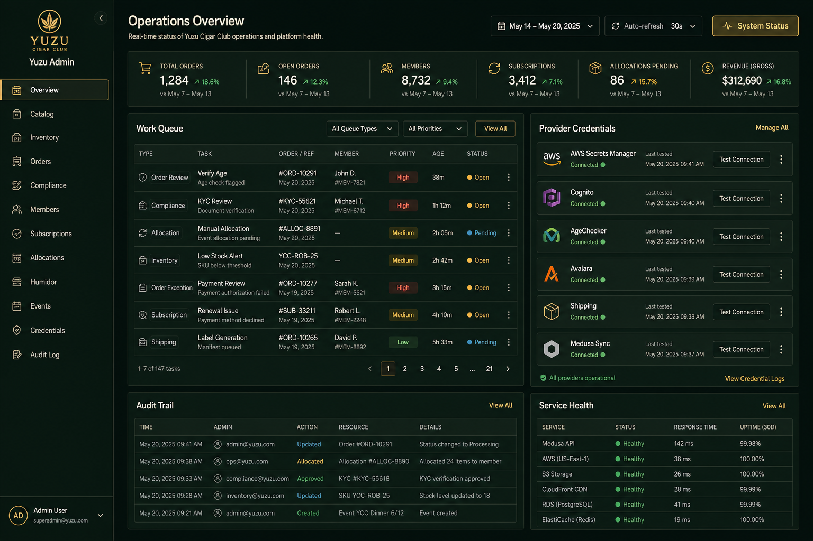

# Yuzu Admin Platform Design

Date: 2026-05-05
Status: Approved design for implementation planning

## Goal

Build the admin experience into a real, end-to-end, local-first management platform for Yuzu Cigar Club. The platform must follow the existing AWS + Medusa architecture direction while giving operators a working local environment for catalog, orders, compliance, members, subscriptions, allocations, humidor data, events, provider credentials, and audit history.

The first implementation target is a production-shaped local stack: Docker Postgres, Redis, Medusa backend, and the existing Next.js storefront/admin app connected to real admin APIs. AWS and vendor integrations are implemented behind adapters so real credentials can be entered through the admin when available.

## Approved Visual Direction

Approved concept image:

The admin should feel like a dense but organized operations dashboard, not a marketing page. It should preserve the current Yuzu visual language: near-black green backgrounds, forest panels, warm gold accents, cream text, muted secondary text, and clear red/amber/green provider states.

## Architecture

The current app is static-exported. Real backend management requires removing `output: "export"` and running the Next app with a server runtime so route handlers, auth checks, and admin mutations can execute. Production deployment will move away from manual static `out/` uploads for the admin runtime; the storefront can remain cache-friendly, but the admin needs a server-capable host.

The local platform will contain:

- Next.js web app for storefront and custom Yuzu admin.
- Medusa backend service for commerce primitives.
- PostgreSQL for Medusa and Yuzu operational data.
- Redis for Medusa sessions/background support.
- Secret storage abstraction with local encrypted dev storage and AWS Secrets Manager production storage.
- Provider adapters for Cognito, AgeChecker/Veratad, Avalara, payment, shipping/adult signature, EventBridge/SNS, and IoT Core.

Medusa owns products, variants, prices, inventory, carts, orders, customer groups, and fulfillment state. The Yuzu admin domain owns compliance cases, provider credential metadata, provider test results, audit logs, subscriptions, allocations, humidor inventory, sensor devices, sensor readings, and event history.

## Admin Surface

The admin app uses a persistent left navigation with these modules:

- Overview
- Catalog
- Inventory
- Orders
- Compliance
- Members
- Subscriptions
- Allocations
- Humidor
- Events
- Credentials
- Audit Log
- Settings

Each module follows one interaction pattern: searchable list or queue, detail/editor panel, explicit actions, safe status messaging, and audit logging. The Overview page surfaces the highest-risk operational work first: compliance holds, missing credentials, failed provider tests, allocation approvals, Medusa sync issues, and humidor alerts.

The Credentials module is first-class. It must show provider cards for AWS, Cognito, Medusa, AgeChecker/Veratad, Avalara, payment, shipping, email/SNS, and IoT. Each card includes configuration status, masked metadata, last updated, last tested, and a Test Connection action.

Production AWS writes use the runtime's IAM role to access Secrets Manager. The admin should not ask operators for long-lived AWS account credentials in production. For local development only, an AWS access key can be stored in the encrypted dev secret backend to test AWS Secrets Manager before the app is deployed with an IAM role.

## Responsive Requirements

The storefront and admin must be responsive across mobile, tablet, and desktop. No primary workflow can require a desktop-only viewport.

Desktop:
- Use the full control-room layout with persistent left navigation, top command area, multi-column metrics, list/detail panels, and right-side provider or action panels.
- Dense tables are allowed, but columns must have stable widths, truncation, readable labels, and clear horizontal behavior only where unavoidable.

Tablet:
- Collapse the left navigation into a compact rail or drawer.
- Keep list/detail workflows usable by stacking detail panels below the selected list or opening them in a sheet.
- Preserve credential setup, provider test actions, compliance review, and product editing without clipped controls.

Mobile:
- Use a drawer or bottom-accessible navigation pattern for admin modules.
- Convert dense tables into scannable cards or stacked rows with the most important fields first.
- Put destructive and credential actions behind explicit confirmations.
- Keep forms single-column with readable labels, large touch targets, visible validation, and no horizontal page overflow.
- Ensure credential setup, provider test results, order hold review, product edit, and audit search are fully usable on a phone.

All responsive layouts must keep text inside its container, avoid overlapping controls, preserve touch targets, and maintain the Yuzu visual system without shrinking typography to unreadable sizes.

## Data Flow

1. The Next admin authenticates an operator and calls the Yuzu admin API.
2. The Yuzu admin API talks to Medusa for commerce records and actions.
3. The Yuzu admin API stores operational Yuzu records in Postgres.
4. Credential forms send raw values only to the secret service.
5. The secret service writes values to local encrypted dev storage or AWS Secrets Manager.
6. Provider adapters read credentials server-side, test connections, and write safe status metadata.
7. Every sensitive action writes an audit event.

Secret values are never stored in ordinary database tables, returned to the browser after save, written into logs, or included in audit payloads.

## Feature Set

Overview:
- KPIs, compliance risk queue, provider health, Medusa sync status, missing credentials, and recent audit events.

Catalog:
- Create and edit cigar box products, metadata, variants, pricing, member-only flags, images, status, and Medusa sync state.

Inventory:
- Stock levels, reorder thresholds, allocation reserves, and warehouse/location notes.

Orders:
- Order list, order details, fulfillment state, compliance holds, adult-signature requirements, and disabled refund/cancel controls until payment credentials are configured.

Compliance:
- Age verification cases, destination restrictions, tax/shipping rule status, manual approve/deny actions, and audit notes.

Members:
- Member profiles, tiers, customer group sync, age verification status, and humidor summary.

Subscriptions:
- Tier plans, renewals, shipment cadence, failed/paused/active statuses.

Allocations:
- Limited drops, member eligibility, reservation counts, publish actions, and close actions.

Humidor:
- Inventory items, smoke logs, humidors, sensor devices, sensor readings, and alert thresholds.

Events:
- Tasting events, RSVP/member access, and publication status.

Credentials:
- Real credential entry for AWS, Cognito, Medusa, AgeChecker/Veratad, Avalara, payment, shipping, email/SNS, and IoT.
- Local encrypted development storage.
- AWS Secrets Manager production storage.
- Write-only secret forms, masked status afterward, and provider connection tests.

Audit Log:
- Searchable action history across modules, credential writes, provider tests, syncs, and manual compliance decisions.

Settings:
- Business profile, compliance mode, secret backend selection, webhook endpoints, and sync intervals.

## Security

- Admin routes require operator authentication and role checks.
- Every mutation checks authorization server-side.
- Client-side hidden buttons are not treated as a security boundary.
- Credential values are write-only after submission.
- Credential input state clears after save or failed submission.
- Local dev secrets require an encryption key from `.env.local`.
- Production secrets use AWS Secrets Manager with KMS-backed encryption.
- Production AWS access is performed through the deployment IAM role; local AWS bootstrap credentials are allowed only in encrypted dev storage.
- Provider tests redact request and response details.
- Audit logs capture actor, module, action, target id, timestamp, outcome, and safe before/after summaries.
- Audit logs must not include secret values, payment details, or unnecessary PII.

## Error Handling

Provider states:

- Not configured
- Saved
- Testing
- Connected
- Degraded
- Failed

Failed provider tests show actionable messages without leaking credentials. Medusa or API outages show module-level degraded banners and retry actions. Destructive actions require confirmation. Sync conflicts show local and remote summaries before overwrite.

## Testing

Unit tests:
- Secret backends
- Provider adapter contracts
- Validation
- Audit log creation

API tests:
- Credential writes
- Provider status reads
- Catalog updates
- Compliance decisions
- Auth failures

UI tests:
- Admin navigation
- Credential setup
- Product edit
- Order hold resolution
- Audit search

Verification:
- Typecheck, lint, build.
- Browser verification for desktop, tablet, and mobile admin layouts.
- Browser verification for no horizontal overflow, no clipped primary controls, and readable responsive tables/cards.
- Browser verification for credential setup and provider test flows.

## Implementation Boundaries

This spec covers the first local-first, production-shaped platform build. It does not require live AWS infrastructure, paid vendor accounts, real payment capture, or real tobacco compliance decisions before credentials are entered. The code must be ready for real credentials and must fail safely when a provider is not configured.

## Source References

- [Existing architecture notes](../../aws-medusa-architecture.md)
- [Medusa Docker installation](https://docs.medusajs.com/learn/installation/docker)
- [Medusa deployment overview](https://docs.medusajs.com/learn/deployment)
- [Medusa Admin API reference](https://docs.medusajs.com/api/admin)
- [AWS Secrets Manager overview](https://aws.amazon.com/documentation-overview/secrets-manager/)
- [AWS SDK for JavaScript Secrets Manager examples](https://docs.aws.amazon.com/sdk-for-javascript/v3/developer-guide/javascript_secrets-manager_code_examples.html)
- [AWS Secrets Manager PutSecretValue API](https://docs.aws.amazon.com/secretsmanager/latest/apireference/API_PutSecretValue.html)
- [Amazon Cognito managed login](https://docs.aws.amazon.com/cognito/latest/developerguide/cognito-user-pools-hosted-ui-user-experience.html)
